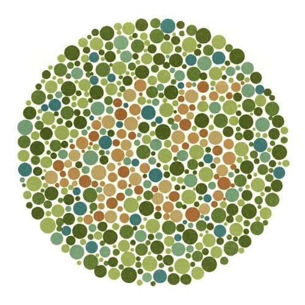

# Lab 2 - Colour Perception

# Part 1: Optical Illusions

### Task 1: Blind Spot

If we position 2 marks on a page:

$$
O
$$

$$
X
$$

we can position one of them in a blind spot, and make it disappear. Looking straight at the right mark, and closing the right eye, we can find the blind spot by moving closer to / further from the screen until the other mark disappears.

This works in patterns too: the brain will interpolate what is meant to be within the blind spot, even if it cannot see it.

### Task 2: **Ishihara Colour Test**



12 plates require identifying the number at their centre. This tests the capability of the long- and medium-wa`Ûvelength sensitivity cones in the eye.

### Task 3: American Flag


After staring at this inverted-colour American flag for 10 seconds, then at a white sheet of paper, a regular American flag appears on the white sheet.

This happens because the cone cells (with varying sensitivity to different colours) become overstimulated and fatigued, temporarily losing sensitivity. This means that after looking away, the brain attempts to compensate for this and produces a brief negative afterimage.

This is as a result of Opponent Process Theory, which states that two separate systems, a magenta-green system and a blue-yellow system, process your vision: magenta and green are antagonists in this system, so staring too long at green will reveal a magenta afterimage.

### Task 4: Troxler’s Fading


Troxler’s fading relies on two phenomena: the Opponent Process Theory, where magenta and green are antagonistic (hence the green dot), and the fact that peripheral vision becomes less sensitive over time - e.g. after a time, you don’t *feel* that you are wearing a hat, unless you move it.

### Task 5: Expectation vs Reality


In the above example, both the red and the green table are the same length on the screen.

Similarly here, A and B are the same colour:


These phenomena are in spite of the information hitting the retina: the brain knows what it *expects* the relative sizes / colours of the object to be due to visual cues such as perspective and shadow, and it maps the visual information onto those expectations.

### Task 6: The Grid


The dark dots appear here due to the concept of *receptive fields*: visual information about a point in our visual field comes from a field of receptors, not just one. In an on-centre receptive field, on-centre luminance excites the field, and off-centre inhibits. On the intersections, there is more off-centre luminance than elsewhere - so the on-centre fields are inhibited and dark spots seem to appear.

### Task 7: Café Wall Illusion


The café wall illusion is probably caused by the irradiation illusion, where light regions appear larger than identically-sized dark regions, as the image disappears if the tiles are replaced by colours of the same brightness or of less contrast.

### Task 8: Silhouette Illusion

The Spinning Dancer can sometimes spontaneously spin the other way! This illusion comes from a lack of information, specifically on depth cues: the viewer has no way of knowing whether the dancer’s limbs are moving in front of or behind their body as they rotate, so the rotation could be happening in either direction.

### Task 9: Incomplete Triangles


In the above image, there are no complete triangles. However, the brain can interpolate between the chevrons and the pac-men to see two triangles placed over the top of each other.

# Part 2: MATLAB

### Task 10: Converting to Grayscale

MATLAB can provide information about an image, drawn partly from EXIF data:

```matlab
>> imfinfo('peppers.png')

ans = 

  struct with fields:

                  Filename: '/Applications/MATLAB_R2023b.app/toolbox/matlab/imagesci/peppers.png'
               FileModDate: '16-Dec-2002 11:10:58'
                  FileSize: 287677
                    Format: 'png'
             FormatVersion: []
                     Width: 512
                    Height: 384
                  BitDepth: 24
                 ColorType: 'truecolor'
           FormatSignature: [137 80 78 71 13 10 26 10]
                  Colormap: []
                 Histogram: []
             InterlaceType: 'none'
              Transparency: 'none'
    SimpleTransparencyData: []
           BackgroundColor: []
           RenderingIntent: []
            Chromaticities: []
                     Gamma: []
               XResolution: []
               YResolution: []
            ResolutionUnit: []
                   XOffset: []
                   YOffset: []
                OffsetUnit: []
           SignificantBits: []
              ImageModTime: '16 Jul 2002 16:46:41 +0000'
                     Title: []
                    Author: []
               Description: 'Zesty peppers'
                 Copyright: 'Copyright The MathWorks, Inc.'
              CreationTime: []
                  Software: []
                Disclaimer: []
                   Warning: []
                    Source: []
                   Comment: []
                 OtherText: []
```

We can also display colour images, as last week:

```matlab
RGB = imread('peppers.png');  
imshow(RGB)
```


We can also convert the image to grayscale using a MATLAB builtin `img2gray()`. This applies a mapping to the image, converting R, G and B into a single grayscale value according to the sensitivity of the human eye’s L, M and S cone cells: `I = 0.299 * R + 0.587 * G + 0.114 * B`.


We can now display the images as a pair, using the Image Processing Toolbox’s `imshowpair()` function.

```matlab
imshowpair(RGB, I, 'montage')
title('Original colour image (left) grayscale image (right)');
```


### Task 11: Using Imsplit()

Using `imsplit()`, we can divide the image up into it’s red, green and blue channels: we can see that red objects are very bright in the red channel, white objects are bright in all three, and green and yellow peppers are strong in both the red and green channels (blue is not a very common colour in nature).


MATLAB processes images as uint8 frames, and we can see here that it is storing the whole RGB image as a 3D matrix, where each of the R, G and B channels are simple 2D matrices. I is the original image, converted to grayscale.


### Task 12: Mapping to HSV

Using the MATLAB builtin `rgb2hsv()`, we can convert the image into HSV format instead of RGB, and then `imsplit()` it into constituent components. The right image (Value) is now a good approximation of the grayscale image, while the Hue and Saturation provide the colour detail.


### Task 13: **Map RGB image to XYZ space**

The XYZ representation of the image is slightly harder to interpret:


It is, however, computed in exactly the same way as the other split images:

```matlab
% Spitting to XYZ and displaying
XYZ = rgb2xyz(RGB);
[X, Y, Z] = imsplit(XYZ);
montage({X, Y, Z}, 'Size', [1 3])
```

The three images represent the mappings of the original colour images onto the X, Y and Z variables of standard XYZ colour space, which do not correspond to specific real-world values - but do combine to produce the original image.